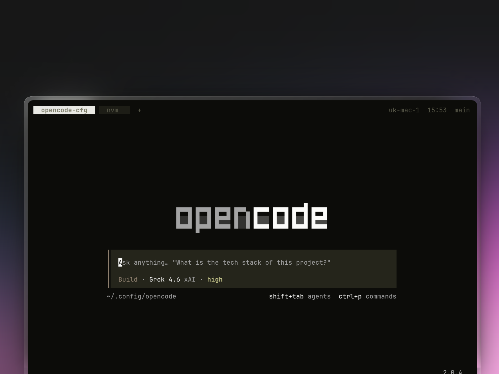

# opencode-config

My [OpenCode](https://opencode.ai) setup (v2).



## Install

```sh
git clone https://github.com/realfizz/opencode-config.git ~/.config/opencode
cd ~/.config/opencode && bun install
```

## What's in here

- `AGENTS.MD`
- `opencode.jsonc`
- `cli.json`
- `commands/`
- `local/`

## Commands

**`/commit`**, turn the diff into small focused commits.

**`/pr`**, same thing but it opens a GitHub PR.

## Plugins

**`git-guard`**, block agents from running `--no-verify`.

**`copy-md`**, copy the last reply as markdown.

**`continue-after-compaction`**, forked from [dmmulroy](https://github.com/dmmulroy/.dotfiles/blob/fcdf06013853c2e8e5718b620d3a2b481fbcedb9/home/.pi/agent/extensions/continue-after-compaction.ts).

**`tuicr`**, hook for code review with [tuicr](https://github.com/realfizz/tuicr).
