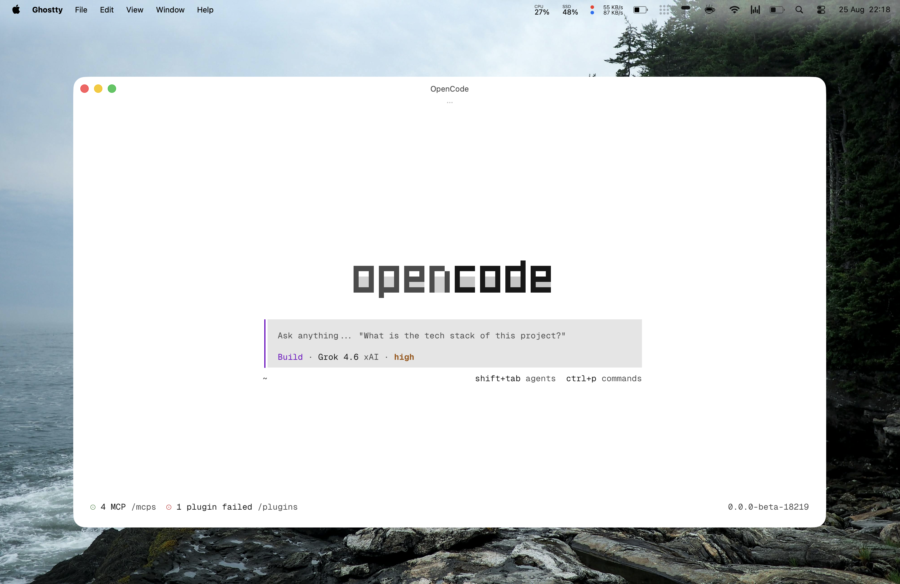

# opencode-config

My [OpenCode](https://opencode.ai) setup.



## Install

```sh
git clone https://github.com/realfizz/opencode-config.git ~/.config/opencode
cd ~/.config/opencode && bun install
```

## Keys

Put these in your shell (`~/.zshrc` or whatever. 

```sh
export EXA_API_KEY=...
export CONTEXT7_API_KEY=...
```

## What's in here

- `AGENTS.md`, global rules
- `opencode.jsonc`, config
- `tui.json`, theme, tps counter
- `cli.json`, cli theme, session, debug
- `commands/`, `/commit`, `/pr`, `/issue`, `/draft`
- `plugins/`, local only (e.g. block `git --no-verify`)
- `skills/`, the ones I actually use
- `themes/`, uhh themes.

## Commands

**`/commit`**, transforms diff into small commits
**`/pr`**, creates a GitHub PR and branch
**`/issue`**, file an issue from chat context (e.g. a bug)
**`/draft`**, draft commit messages
