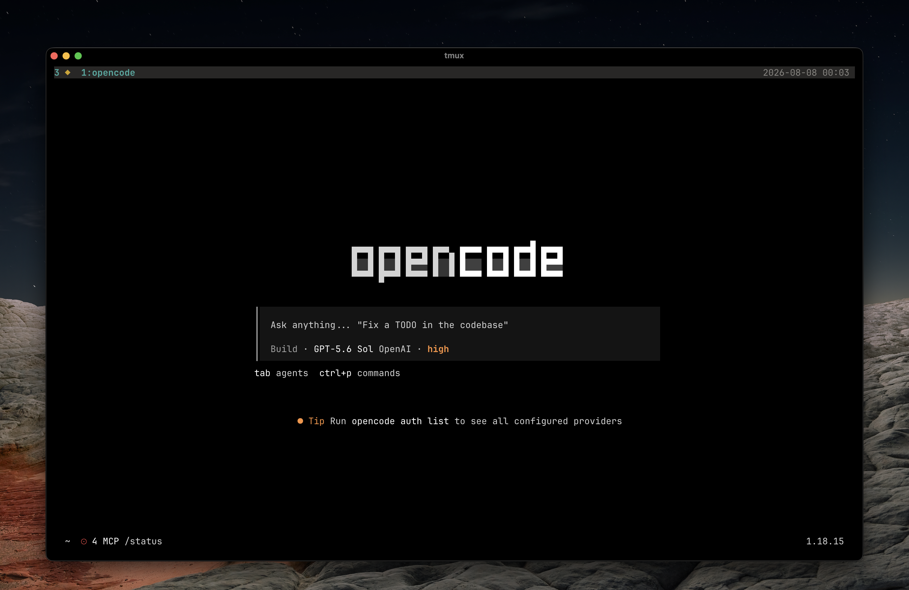

# opencode-config

My [OpenCode](https://opencode.ai) setup.



## Install

```sh
git clone https://github.com/realfizz/opencode-config.git ~/.config/opencode
cd ~/.config/opencode && bun install
```

Or clone somewhere else and symlink it:

```sh
git clone https://github.com/realfizz/opencode-config.git ~/dev/opencode-config
ln -sfn ~/dev/opencode-config ~/.config/opencode
cd ~/dev/opencode-config && bun install
```

## Keys

Put these in your shell (`~/.zshrc` or whatever). OpenCode reads them via `{env:…}`.

```sh
export EXA_API_KEY=...
export CONTEXT7_API_KEY=...
```

## What's in here

- `AGENTS.md` — global rules
- `opencode.jsonc` — mcp, providers (no secrets)
- `tui.json` — theme + tps counter
- `commands/` — `/commit`, `/pr`, `/issue`, `/draft`, `/deslop`, `/linear`
- `plugins/` — local only (e.g. block `git --no-verify`)
- `skills/` — the ones I actually use
- `themes/`

## Commands

**`/commit`** — split the diff into conventional commits and land them

**`/pr`** — branch if needed, push, open a GitHub PR (does not merge)

**`/issue`** — file one GitHub issue from chat (bug/idea parking lot)

**`/draft`** — draft commit messages without committing

**`/linear`** — create Linear issues from chat

**`/deslop`** — rip AI slop out of the branch
